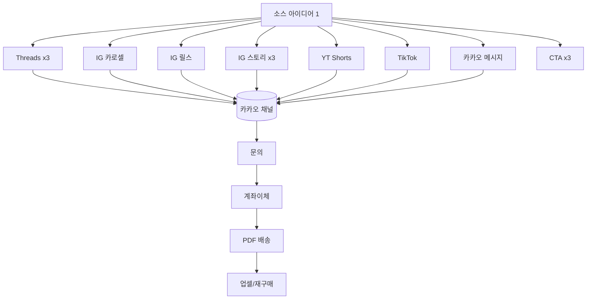

# 사주도령 — 7일 매출 재건 성장 플랜 v2 (실데이터·시장가·검증 심리기법 반영)

> 목표: 7일 안에 **일 매출 KRW 200,000 이상** 회복.
> 브랜드: **사주도령(@bachelor.saju)** — 서담선생(당근 프로젝트)과 별개 퍼널.
> 채널: Instagram(3.1만) · Threads(1만) · Kakao 채널(최종 전환점).
> 결제: 계좌이체 · 배송: PDF · 차별화: 명리학 + 자미두수 + 심리 기반 해석.
> 갱신: 2026-06-08 · 모드: Plan(승인 전 파일/설정/계정/자동화 변경 금지).
> 전 섹션 공통 요건: **검증된(근거 있는) 심리 마케팅 기법을 빠짐없이 적용**(§A), **결과·시기 보장/공포조장/가짜희소성 금지**.

---

## Context (왜 이 플랜인가 — 실데이터로 재정의)

과거 IG·Threads·Kakao로 월 약 2,000만원 → 현재 거의 0. 사용자 진술: "계정 활동 전체 멈춘 지 오래". 
스크린샷 13장 + Threads/IG 인사이트 + 카카오 관리자센터로 진단한 결과, **매출 0의 원인은 "청중 소멸"이 아니라 "게시 중단 + 전환 퍼널 붕괴"**다 — 둘 다 고칠 수 있다.

실데이터 핵심 발견:
1. **청중 건재.** IG 팔로워 3.1만(게시물 468), Threads 1만. 휴면인데도 최근 90일 조회 Threads 67만 + IG 15만(도달 5.8만). 노출 자산 충분.
2. **1번 병목 = SNS→카카오 클릭 붕괴.** IG 90일 프로필 방문 3,790인데 **외부 링크 누름 66건**(≈1.7%). 노출 82만 대비 카카오 유입 사실상 0. 매출 0의 구조적 원인.
3. **카카오 퍼널 자체 고장.** ① 채팅방 리스트 메뉴 **사용 OFF** ② "직업/사업/이동 패키지" 자동응답 **연결 안 됨**(죽은 메뉴) ③ 웰컴메시지가 일반 인사(자기진단·가격·오퍼 없음), 버튼 1개(상담 바로가기 → 소식글 107209416).
4. **가격 파편화·상시할인.** 단품 1만 / 연애패키지 1.8·2.7·5·5.5만 / 종합 7.5만 / 사주풀이 3.5만(50% 상시할인). 신규가 "뭘 얼마에"를 이해 못함 + 상시할인=실질정가 표시광고법 리스크.
5. **먹히는 콘텐츠 확인.** 재물운·시기성·여성타깃("6월부터 재물운이 쏟아지는 여자분들", "운이 확 바뀌기 직전 현상", "직장보다 사업이 맞는 여자 사주"). 조회는 잘 나오나 클릭 전환 실패 → 후킹 OK, CTA·랜딩·게시중단이 문제.
6. **배송 엔진 작동.** sajugen 명리+자미 tagged PDF, CLI/FastAPI, pytest 34/34. 차별화가 산출물로 뒷받침.

**실행 원칙(사용자 지정):** ① 1인 한계 가정 X — AI 에이전트/지식 총동원, 병목은 트래픽·전환·신뢰. ② 한 번에 한 가지 좁은 작업만(절대 몰지 않음). ③ 가격은 시장조사 기반·과하지 않게. ④ 검증된 심리 마케팅 기법을 전 섹션에 적용. ⑤ sajugen 고도화는 7일 레이스와 분리.

---

## A. 검증된 심리 마케팅 기법 — 전 섹션 적용 매핑 (NEW · 필수 요건)

근거 있는 원칙만 사용(Cialdini 6+1, 행동경제학). 윤리 가드: 가짜희소성·공포조장·결과단정 금지.

| 기법(근거) | 적용 위치 | 사주도령 실행 예 |
|---|---|---|
| 사회적 증거(Cialdini) | 프로필·웰컴·결제직전·후기메뉴 | "7만+건 상담"·후기 모음(이미 보유)을 결제 직전에 재배치 |
| 권위(Cialdini) | 포지셔닝·구성 설명 | "명리(큰 구조)×자미두수(세부 타이밍) 교차 정통 풀이" |
| 희소성-진짜(Cialdini) | 재활성 캠페인 | 상시할인 폐지 → **명확한 마감일 N일 한정** |
| 상호성(Cialdini) | 콘텐츠·웰컴 | 무료 미니 자가진단/가치 선제공 후 오퍼 |
| 일관성·약속(Cialdini) | 채팅 메뉴 동선 | 자기진단 메뉴 클릭(작은 예스) → 신청(큰 예스) |
| 호감(Cialdini) | 웰컴 톤 | 현재 따뜻한 톤 유지(강점) |
| 통일성/정체성(Cialdini 7th) | 프로필·CTA | "답을 찾는 분들" 공동체 정체성 |
| 앵커링(Tversky-Kahneman) | 가격표 | 프리미엄 59,000 먼저 → 코어 29,000이 합리적으로 보이게 |
| 디코이 효과 | 3단 가격 | 코어를 "가장 인기" 기본 선택지로 배치 |
| 손실회피 | 시기성 카피 | "기회를 놓치지 않도록"(단정·공포 X) |
| 처리유창성 | 가격·메뉴 | 파편가격 → 3단 단순화, 메뉴 정리 |
| 자이가르닉/오픈루프 | 후킹 | 현재 잘 되는 오픈루프 후킹 유지·강화 |
| 보유효과 | 오퍼 네이밍 | "내 사주 구조 PDF"(소유감) |
| 구체성 | 전 카피 | 항목·페이지수·납기 구체 명시 |

> 실행 시 모든 카피 산출물은 "이 카피에 쓰인 심리기법 3개 + 윤리 가드 통과 여부"를 주석으로 달아 검증.

---

## 1. Executive Summary — 20만원/일까지 가장 유력한 경로

**가장 빠른 돈 = 따뜻한 카카오 친구 재활성(클릭 불필요).** SNS 클릭 붕괴(66/90d)를 우회해 이미 채널 안에 있는 친구에게 직접 도달. 유료 발송 OK.
**구조적 회복 = SNS→카카오 전환율 복구 + 게시 재개.** 노출 82만은 살아있으니, CTA·오퍼 명확화로 CTR만 끌어올려도 매출 레버가 큼.

3-트랙(실행은 스텝별 단일 초점):
- **트랙 A (즉시 / Day 1~3):** 카카오 친구 재활성 — 가치선행 + **기간한정** 코어/프리미엄 오퍼 발송(광고성 표기·야간차단 준수). 심리: 사회적증거+진짜희소성+상호성.
- **트랙 B (지속 / Day 1~7):** 게시 재개 + 프로필 CTA·링크 동선 복구로 CTR 회복. 먹히는 후킹(재물·시기·여성타깃) 재가동, 1소스→11채널 리퍼포징.
- **트랙 C (전환 / Day 1~2 세팅):** 카카오 퍼널 고장 수리(리스트메뉴 ON·죽은메뉴 복구·웰컴 미니랜딩화·가격 3단 정리) + 계좌이체 신뢰·추가질문 정책 + 소스별 키워드 추적 시트.

**권장 매출 믹스(신가 기준 §9):** 프리미엄 59,000 × 2 + 코어 29,000 × 3 ≈ 205,000(5건). 재활성 피크일엔 단독 초과 가능. 용량은 병목 아님 — 병목은 "문의 수".

---

## 2. Data Room Audit (스크린샷 수신 — 실측 확보)

| Data Source | 상태 | 실측/요지 | 다음 행동 |
|---|---|---|---|
| Instagram 인사이트(90일) | 수신 | 팔로워 3.1만·게시물468·조회15만·도달5.8만·반응4001(참여3076)·프로필방문3790·**외부링크 66**·최활동 월요일/저녁 | CTR 복구 타깃 = 외부링크 66 |
| Threads 인사이트(90일) | 수신 | 팔로워1만·조회67만·반응1520·인기글(운 바뀌기 직전 현상 1.2만 등) | 후킹 재사용, 게시 재개 |
| Kakao 채널 통계 | 부분(HomeStat.xls 보유) | 웰컴 활성·자동응답5(1 미연결)·리스트메뉴 OFF·야간차단20:55~08:00 | **실행단계 HomeStat 파싱**(친구수·추세) |
| 판매/결제 기록 | 없음→신규 | 구글시트/로컬 트래커 신설 | §12 |
| 이행(PDF) | 작동 | sajugen CLI/FastAPI, pytest34/34 | 코어/프리미엄 배송 엔진 |
| 콘텐츠 아카이브 | 보유 | 후킹 라이브러리·드래프트·먹힌 릴스/스레드 패턴 | 재사용 |
| 후기 자산 | 보유 | IG 하이라이트·소식 "2025 7월 후기 모음"·고정글 후기 | 사회적증거로 결제직전 재배치 |
| 현재 가격표 | 수신 | 단품1만/연애1.8·2.7·5·5.5만/종합7.5만/사주3.5만(상시할인) | §8 3단으로 정리 |

---

## 3. Tool Access Audit (감사 완료 — 변경 없음)

| Tool/API/MCP | 가용 | 7일 활용 | 비고 |
|---|---|---|---|
| WebSearch/WebFetch, 로컬 Read/Glob/Grep | O | 조사·자산 재사용 | — |
| Google Drive MCP(세션 라이브) | O | 트래킹 시트 | OAuth |
| Python venv(sajugen) | O | PDF 배송·HomeStat 파싱·글루 | 읽기/생성 |
| GitHub CLI | O(인증) | 스킬/코드 버전관리 | — |
| Threads API(무료)/IG Graph | 가능(미연동) | **Later**(인사이트 자동수집) | 7일엔 수동 |
| Kakao 발송/통계 API | **불가/없음** | 발송=관리자센터 수동, 통계=HomeStat/캡처 | 친구톡=대행사 계약 |
| CapCut | 공식 API 없음 | 영상 템플릿 수동, 대체(Shotstack/JSON2Video) Later | 비공식 ToS 회피 |
| Playwright MCP | 설치형(미활성) | 캡처/검수 보조(선택) | 플랫폼 ToS 주의 |

> 가드레일: 카카오 발송·통계 자동화 7일 내 금지. CapCut 비공식 API 금지. shell은 PowerShell/cmd 금지(사용자 지정) — 파이썬은 승인하에만.

---

## 4. Verified Source Map (가격 시장조사 = 신규 핵심)

| Area | Source | Key Finding | 함의 | 신뢰 |
|---|---|---|---|---|
| 사주 시장가 | 크몽 gig/300610(리뷰797·판매2432) 등 | 실질 성공 앵커 **18,000~33,000원**(스탠다드~디럭스) | 코어를 시장 중앙값에 | High |
| PDF 수작업형 | 크몽 gig/611431, 와디즈 설선생(38,000) | PDF 수작업 20,000~60,000원, 자동생성은 990~5,000원 | "수작업+자미 교차" 가치로 프리미엄 정당화 | High |
| 자미두수 | 크몽 gig/488939·562740 | 명리 대비 입문 높고 중·고가 수렴(약 10~20%↑) | 자미두수=전문성 프리미엄 키워드 | Med |
| 첫상담 할인 관행 | 네이버 엑스퍼트 | 첫 상담 6,000~9,000원대 | 입문 9,900 근거 | Med |
| Kakao 발송/통계 | kakaobusiness/developers.kakao | 친구목록 export·직접발송 불가, 통계 UI전용 | 수동 발송+수동/HomeStat 추적 | High |
| Threads/IG API | developers.facebook.com | Threads 무료 API(게시+인사이트), IG Graph 인사이트(90일) | Later 자동수집 | High |

---

## 5. Current Funnel Diagnosis (실데이터 확정)

흐름: SNS 프로필 → 카카오 채팅 → 웰컴/메뉴 → 자동응답 → 문의 → 계좌이체 → PDF → 추가질문 → 재구매.

확정된 누수 지점(우선순위순):
1. **SNS→카카오 클릭(치명적):** IG 외부링크 66/90일. 원인 = ① 게시 중단(신규 노출 없음) ② 프로필 CTA가 클릭 이유·긴급성·오퍼 불명확 ③ IG 링크 1개 한계(카카오+스레드 혼재). → 게시 재개 + 프로필 카피/링크 동선 복구가 최대 레버.
2. **카카오 퍼널 고장(중대):** 리스트 메뉴 OFF(메뉴 노출 안됨) / "직업·사업·이동" 자동응답 미연결 / 웰컴이 일반 인사라 "자기진단→오퍼선택" 동선 없음.
3. **가격 이해 불가(중):** 7개+ 가격점 + 상시할인. 처리유창성 저하로 결정 마비.
4. **결제 마찰(중):** 계좌이체 신뢰요소(사업자/수령물/타임라인/책임)가 결제 직전에 묶여있지 않음.
5. **재구매 동선 부재(중):** 배송 후 추가질문·업셀 경로 없음 → LTV 0.

강점(유지): 웰컴 톤(호감), 후기 자산(사회적증거), 먹히는 후킹(오픈루프·시기성), 정통 풀이 12항목(권위).

---

## 6. Direct Chat vs Landing/Sosik Route — 권장

데이터 반영: SNS 클릭 자체가 희소(66/90d)하므로 **클릭한 사람을 절대 놓치면 안 됨** → 마찰 최소 + 설득 내장이 최우선.

- **7일 기본값 = Route D**: 채팅 직행 + **웰컴메시지를 미니랜딩으로 개조**(자기진단→구성→가격→후기→신청) + 리스트메뉴 ON. 클릭 최소 + 설득 내장.
- **콜드 IG 신규 A/B = Route B**: 소식글(랜딩)로 증거·가격 선이해 후 채팅(이미 후기/구성 소식 보유 → 재활용).
- 승자 판정: 채널별 키워드 유입 대비 문의·결제 전환율(수동 시트).

---

## 7. Recommended Kakao Channel Structure (고장 수리 + Route D + 심리기법)

**즉시 수리(고장):**
- 채팅방 **리스트 메뉴 ON**.
- "직업/사업/이동 패키지" 자동응답 **재연결**.
- 웰컴 버튼: 현재 1개(소식 링크) → "나에게 맞는 풀이 고르기"(자기진단) + "신청/가격 보기" 2버튼.

**웰컴메시지 미니랜딩화(톤은 유지, 구조만 보강):**
- 첫 문장(호감+권위+자기이해): "명리로 인생의 큰 구조를, 자미두수로 세부 타이밍을 교차로 봐 드립니다. 지금 가장 궁금한 한 가지부터 골라보세요."
- 이미지: 현재 四柱命理學 이미지 유지 + 수령물(PDF 구성) 1장 추가(처리유창성·보유효과).
- 사회적증거 1줄: "지금까지 7만+건의 이야기를 함께 봤습니다"(후기 메뉴로 연결).

**채팅방 메뉴 순서(일관성·앵커링):** ① 나에게 맞는 풀이 고르기(자기진단) → ② 사주풀이 구성(권위) → ③ 가격표(프리미엄→코어→입문 앵커링) → ④ 실제 후기(사회적증거) → ⑤ 신청 방법(필수) → ⑥ 연애 / ⑦ 직업·사업·이동(재연결).

**자동응답 메뉴명(행동유발·구체성):** "연애 흐름·타이밍 보기", "직업/사업/이동 결정 기준 보기", "내 사주 구조 한눈에".

**배치:** 가격표=구성 직후 / 후기=가격 직전(저항 완충) / 신청=후기 직후(결제 직전).

**계좌이체 신뢰(결제 직전 5요소·보장표현 無):** 증거 선노출 → 입금자명=신청자명 확인 → 수령물(명리+자미 교차 PDF + 질답1) → 납기(○○시간 내) → 지연 시 책임 약속.

**추가질문 정책:** 범위(PDF 이해 질문 1회)·제외(새 명식/무제한은 별도 오퍼)·응답시간·AI초안+사람검수·개인정보(로컬 처리).

**사람 개입:** 결제확인 + 명식검수 + 추가질문은 사람 최종검수.

---

## 8. Offer Ladder (시장조사 기반 가격 리셋 · "과하지 않게")

> 현재 가격(종합 7.5만/할인 3.5만)은 시장 대비 높음. 시장 성공 앵커(18,000~33,000) + "너무 비싸면 안 됨"에 맞춰 리셋. **상시할인 폐지 → 기간한정.**

| 단계 | 권장가 | 내용 | 명리+자미 차별 | 배송 | 시장 근거 |
|---|---:|---|---|---|---|
| **입문(콜드 전환)** | **9,900** | 1주제(연애/재물/직업 택1) 핵심 미니 PDF | 핵심 1축 요약 | sajugen 미니 | 첫상담 할인가·1만 미만 심리장벽 |
| **코어(메인)** | **29,000** | 종합 PDF(성향·2026 대운·3대 주제·핵심조언) | 명리 중심 + 자미 보조 | sajugen 풀 + 질답1 | 크몽 1위 실판매 중앙값(18~33k) |
| **프리미엄** | **59,000** | 심층 + **명리×자미두수 교차** 20p+·5년 흐름 | 교차분석 = 핵심 차별 | sajugen 확장 + 질답1 | 크몽 고가밴드(55~60k)·자미 프리미엄 |
| (옵션) 궁합 추가 | +20,000 | 상대 궁합 | — | 추가 | 시장 2인 궁합 30~70k |
| (옵션) 당일납기 | +5,000 | 24h 우선 | — | — | 다급성 수요 |

**첫 판매 오퍼(트랙A 기간한정):** 코어 29,000(대중) + 프리미엄 59,000(자미 교차, 객단가). 입문 9,900은 콜드 SNS 신규 깔때기.
가격 제시 시 앵커링·디코이: 프리미엄 먼저 → 코어를 "가장 인기" 기본값.

> 실행 시 정정: `saju-growth-system/strategy/offer-ladder.md`의 코어 59,000 → **코어 29,000 / 프리미엄 59,000**로 수정, 브랜드 "서담선생"→"사주도령" 교정 필요(현재 파일에 잔존).

---

## 9. Revenue Math — 20만원/일 (신가 기준)

| 가격 | 단독 필요건수 | 현실성 | 역할 |
|---:|---:|---|---|
| 9,900 | ~20 | 낮음(많이 필요) | 콜드 깔때기·업셀 진입 |
| 29,000 | ~7 | 중(재활성 시 가능) | 메인 볼륨 |
| 59,000 | ~3.4 | 높음 | 객단가 핵심 |

**가장 빠른 현실 믹스:** 프리미엄 2(118,000) + 코어 3(87,000) ≈ **205,000**(5건). 
대안: 프리미엄 1 + 코어 4 + 입문 5 ≈ 224,500. 재활성 피크일엔 초과 여지. 가격 하향으로 건수 허들↓ → 전환율 개선과 결합 시 도달 가능성↑.

---

## 10. 7-Day Execution Plan (각 날 단일 초점)

| Day | 단일 초점 | 핵심 행동 | Kakao | 트래킹/자동화 | 지표 |
|---|---|---|---|---|---|
| 1 | 측정 기반 | HomeStat 파싱(친구수·추세), 트래커 시트 생성, 가격 3단·신뢰·질답 정책 확정 | — | 시트 + 파싱 | 시트 가동·친구수 확정 |
| 2 | 카카오 수리 | 리스트메뉴 ON·죽은메뉴 복구·웰컴 미니랜딩·가격표 3단(앵커링) | 구조 적용(사용자 관리자센터) | — | 메뉴 노출·클릭 |
| 3 | **재활성 발송(엔진)** | 친구 대상 가치선행+기간한정 오퍼(사회적증거·희소성·상호성) | 발송+자동응답 점검 | 발송 키워드 추적 | 노출·클릭·문의·결제 |
| 4 | 게시 재개(CTR) | 먹힌 후킹 재가동, 프로필 CTA·링크 동선 복구, 1소스→11 | 소스별 유입 키워드 | repurpose.py | 외부링크·문의 |
| 5 | 루트 A/B | 콜드 IG는 Route B(소식 랜딩) 병행 | 소식 1 | — | 루트별 전환 |
| 6 | 2차 발송/업셀 | 미응답 리마인드 + 구매자 프리미엄/궁합 업셀 | 2차 메시지 | — | 재구매·업셀 |
| 7 | 결산·고정 | daily_metrics_summary.py 요약, 승자 루트/오퍼/훅 확정 | 미세조정 | 메트릭 요약 | 일매출 달성 |

---

## 11. Content Repurposing System (1 소스 → 11)

`content/repurpose-prompts.md` + `automation/repurpose.py` 보유. 1소스 → Threads3/IG카로셀1/릴스1/스토리3/Shorts1/TikTok1/카카오1/CTA3. 먹힌 패턴(재물·시기·여성타깃·오픈루프) 우선. 모든 CTA에 심리기법(통일성·상호성·희소성) 적용.

---

## 12. Account/Data Tracking System

구글시트(Drive MCP) 또는 로컬 xlsx(openpyxl/pandas). 필드: date·channel·content ID·hook type·URL·CTA·link variant·kakao keyword·views·comments·saves·shares·profile clicks·외부링크·kakao inflow·menu clicks·inquiries·payments·revenue·offer·PDF delivered·extra questions·repurchase·notes. 카카오 지표는 HomeStat/관리자센터 캡처에서 수기(노출·클릭; 오픈율 없음→CTR 프록시). 핵심 KPI: **외부링크 클릭수**(현재 66 기준선)와 **문의→결제 전환율**.

---

## 13. Automation Architecture (7일엔 Level 1·일부 2)

| Task | 기존툴 우선 | 권장 | Now/Later |
|---|---|---|---|
| 트래킹 시트 | Drive MCP/시트 | 수동입력+시트 | Now |
| HomeStat 파싱 | python(openpyxl/pandas) | 읽기전용 스크립트(승인 후) | Now(Day1) |
| 1→11 리퍼포징 | repurpose.py(보유) | 그대로 | Now |
| 메트릭 요약 | daily_metrics_summary.py(보유) | 그대로 | Now(Day7) |
| 캘린더→스케줄러 | calendar_to_csv.py→Publer/Metricool | 임포트 | Now(선택) |
| 카카오 발송 | — | 수동(관리자센터) | Now(수동) |
| 추가질문 보조 AI | Claude | privacy-safe 워크플로 | Later |
| Threads/IG 자동게시·인사이트 | Threads API/IG Graph | 후속 연동 | Later |
| sajugen 고도화 | sajugen | 분리 트랙 | Later(별도) |
| 영상 자동화 | Shotstack/JSON2Video | 검토만(CapCut 공식API無) | Later |

---

## 14. Claude Code Implementation Plan (승인 후 · 한 스텝씩)

기존 `saju-growth-system/` 재사용·보강(난립 금지). 실제 구조는 `strategy/ templates/ content/ tracking/ automation/ checklists/ research/`(플랜 초안의 copy/·pdf-product/ 폴더는 미존재 → 실제 구조 사용).

1. (Day1) HomeStat 파싱 스크립트(읽기전용) + 트래커 시트 + 가격 3단/신뢰/질답 카피 확정 → `tracking/`, `strategy/offer-ladder.md`(가격·브랜드 교정).
2. (Day2) 카카오 수리·웰컴 미니랜딩·가격표 3단 문서화(적용은 사용자) → `strategy/`(kakao 퍼널), `templates/kakao-channel-messages.md`.
3. (Day3) 기간한정 재활성 발송 카피(심리기법 주석 + 컴플라이언스 통과) → `templates/`.
4. (Day4~5) 게시 재개 + 1소스→11 + 소식 랜딩 1종.
5. (Day7) 메트릭 요약·승자 확정.
6. (별도) sajugen 고도화 — 7일 종료 후.

> **커스텀 Skills(승인 후·필요순, 1주차엔 ①②만):** ① compliance-checker(금지어 hook 연계) ② saju-copywriter(심리기법 내장) ③ content-repurposer(스크립트 래핑) ④ kakao-funnel-auditor ⑤ metrics-analyst ⑥ saju-offer-designer ⑦ pdf-reading-template-builder.

---

## 컴플라이언스 / 개인정보 (요지)

- **표현 가드(필수):** 현재 "불안을 확신으로", 릴스 "재물운이 쏟아진다" 등 단정·예언형은 표시광고법 리스크 → "참고용 해석·선택 기준" 프레이밍으로 순화. 금지: 100%·무조건·완치·수익보장·결혼/합격/재물 확정. 허용: 사회적증거·구체성·자기진단·진짜희소성·고객언어. 금지어 hook + compliance-checker 이중 점검.
- **상시할인 폐지:** 진짜 기간한정(시작·종료일 명시)으로 전환(표시광고법 안전 + 진짜 희소성).
- **개인정보:** 생년월일시·성별·고민은 민감정보. sajugen 로컬 처리, 외부 LLM 불필요 업로드 금지. 분석 로그 익명화(PII 분리). 스크린샷 내 계좌·실명·연락처는 마스킹 권장.

---

## Verification (실행 단계 검증)

1. **HomeStat 파싱:** 친구수·추세·메시지 통계가 시트에 들어오는지(읽기전용 파이썬, 승인 후).
2. **트래커 가동:** Day1~7 행 적재 + daily_metrics_summary.py 요약 출력.
3. **퍼널 정합:** 채널 키워드 유입 → 외부링크 → 문의 → 결제가 시트에서 끝까지 연결(끊김 = 병목).
4. **배송 검증:** sajugen으로 실제 명식 1건 PDF(CLI) → tagged·구성 확인 → 채팅 전달 리허설.
5. **카카오 수리 확인:** 리스트메뉴 노출·직업메뉴 연결·웰컴 2버튼 동작.
6. **컴플라이언스:** 모든 발신 카피 금지어 hook + compliance 0건 통과 후 게시.
7. **심리기법 적용:** 각 카피 산출물에 적용 기법 3개 + 윤리가드 통과 주석.
8. **목표 판정:** 7일차 일매출 ≥ 200,000 + 승자 루트(D vs B)·오퍼·훅 확정.

---

## 승인 시 즉시 필요한 입력(사용자)

1. 가격 리셋(입문 9,900 / 코어 29,000 / 프리미엄 59,000) 확정 또는 조정.
2. 계좌이체 신뢰 카피용 사업 정체성 노출 범위(상호/사업자/연락처).
3. 재활성 기간한정 캠페인 기간(예: 5일) 및 시작일.
4. HomeStat.xls 파싱을 위한 파이썬 1회 실행 승인(읽기전용).
